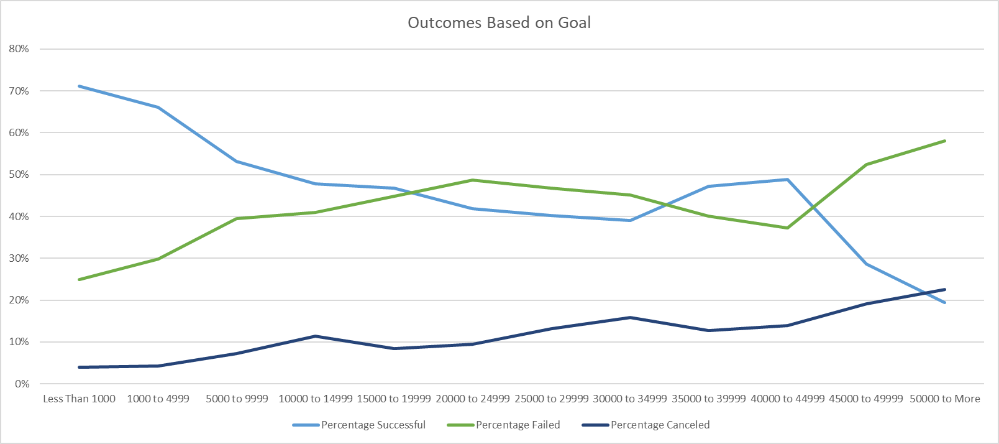
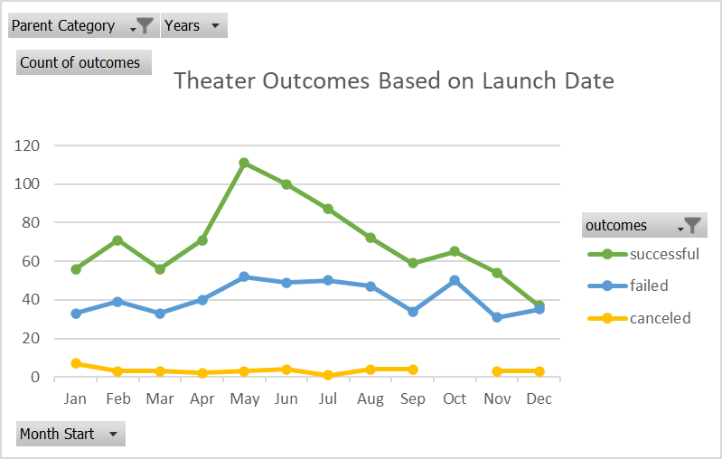

# Kickstarting with Excel

## Overview of Project
### Excel file containing 4115 x 22 (rows/columns), with seven spreadsheets containing the results for the Kickstarter project.

### Purpose
#### The project's purposes are to give Louise’s efforts to come close to its fundraising goal in a short amount of time. In addition, the sponsor wants to accomplish how select endeavours fared regarding their launch dates and funding goals. With the dataset that has already been scrutinized, it'll be possible to analyze campaign outcomes based on their launch dates and funding goals. After handling the results, it'll be submitted as a written report based on the analysis and the visualizations created for that purpose.

## Analysis and Challenges
### The project kicked off with a large amount of data collected, and as the primary tool, the pivot table was used to discover the trends pointed out through the results. The substantial initial effort was not visible as a data analyst, so the data was cleared, sequenced and organized through the MS Excel spreadsheets.

### Analysis of Outcomes Based on Launch Date
#### The analysis found that campaigns that achieved outstanding success were strictly tied to the launch date. Following this line of reasoning, for a campaign launched between April and August, its chances of acceptance and support were noticeably higher, gaining many fundraisers.

### Analysis of Outcomes Based on Goals
####Right from the start, the project team faced a challenge in understanding the parameters related to the success and failure of the released campaign. Analyzing the data collected, it was possible to establish the results. In general, in movements where the goal was lower funding, the chances of success increased and presented better than expected results. The same cannot be said about the opposite, and it is easy to understand that by aiming for a more significant donation, the campaign's rejection was thus increased.

### Challenges and Difficulties Encountered
#### The great challenge encountered by the project team was related to analyzing the campaigns about their launch dates; there was a conversion in the line graph between those that were successful and those that failed when they started in December.

## Results

- What are two conclusions you can draw about the Outcomes based on Launch Date?
  - Success and Failure are correlated. In a given campaign, failure can be significantly greater than success. For instance, if the goal was to raise 45,000, the chance of failure approaches 100%, resulting in a 0% successful rate.
  - As mentioned before, in the summer months, from April to August, the number of supporters (total) is higher than in other months.
  
  
  
- What can you conclude about the Outcomes based on Goals?
  - It was observed the tendency of the campaigns carried out when the objective was a smaller collection, the chances of success were greater.
  - A curiosity observed in the dataset was the non-observance of cancelled campaigns as projects that obtained negative results, that is, failed.
  
  

- What are some limitations of this dataset?
  - The observed limitation of the data set, according to the project team, was the correlation between the evaluation of the supporters; it was not possible to know the reasons for satisfaction when adding funds or the reason for the cancellation.

- What are some other possible tables and/or graphs that we could create?
  - The lack of creation tables and graphs was noticed to demonstrate the correlation between supporters and their success rate.
  - Also, in future data analysis, it would be opportune to make a correlation between the countries where the campaigns were carried out, for example, where they were more successful and why.
